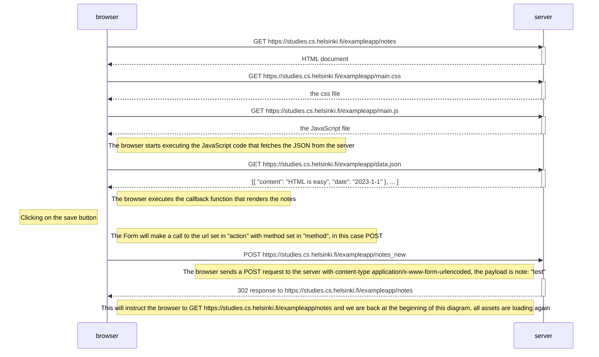

```mermaid
sequenceDiagram
    participant browser
    participant server

    browser->>server: GET https://studies.cs.helsinki.fi/exampleapp/notes
    activate server
    server-->>browser: HTML document
    deactivate server

    browser->>server: GET https://studies.cs.helsinki.fi/exampleapp/main.css
    activate server
    server-->>browser: the css file
    deactivate server

    browser->>server: GET https://studies.cs.helsinki.fi/exampleapp/main.js
    activate server
    server-->>browser: the JavaScript file
    deactivate server

    Note right of browser: The browser starts executing the JavaScript code that fetches the JSON from the server

    browser->>server: GET https://studies.cs.helsinki.fi/exampleapp/data.json
    activate server
    server-->>browser: [{ "content": "HTML is easy", "date": "2023-1-1" }, ... ]
    deactivate server
    Note right of browser: The browser executes the callback function that renders the notes

    Note left of browser: Clicking on the save button
    Note right of browser: The Form will make a call to the url set in "action" with method set in "method", in this case POST
    browser->>server: POST https://studies.cs.helsinki.fi/exampleapp/notes_new
    Note left of server: The browser sends a POST request to the server with content-type application/x-www-form-urlencoded, the payload is note: "test"

    activate server
    server-->>browser: 302 response to https://studies.cs.helsinki.fi/exampleapp/notes
    deactivate server
    Note right of browser: This will instruct the browser to GET https://studies.cs.helsinki.fi/exampleapp/notes and we are back at the beginning of this diagram, all assets are loading again


```
